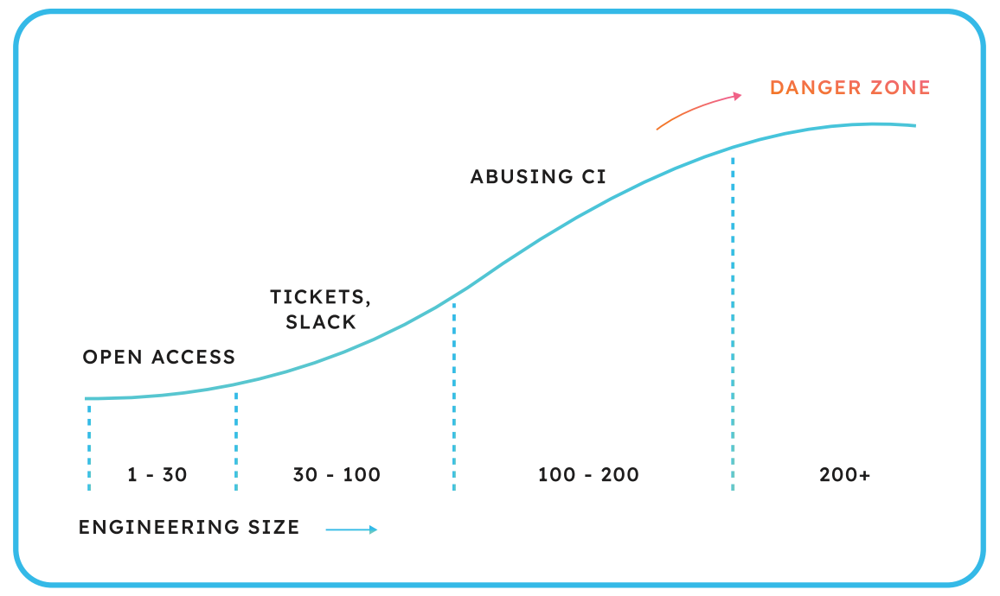

> 이 글은 내부 개발자 포털인 [Port](https://www.getport.io/)에서 제작한 [The Definitive Guide to Internal Developer Portals](https://info.getport.io/definitive-guide-to-internal-developer-portals)을 번역했음을 알립니다.

## The Definitive Guide to Internal Developer Portals

플랫폼 엔지니어는 더 나은 개발자 경험(DX)을 통해 생산성과 [리텐션](https://blog.ab180.co/posts/retention-series-1)을 높이는 핵심 임무를 맡고 있습니다. 내부 개발자 포털(Internal developer portals, IDP)은 이를 위한 기본 조건입니다. 이번 글에서는 IDP가 왜 필요하며 어떻게 써야 하는지, 그리고 IDP가 개발자 경험과 생산성에 어떤 영향을 끼치는지를 설명합니다.

## 1. Introduction: platform engineering

최근, 우리는 마이크로서비스, 컨테이너와 여러 DevOps 툴, 클라우드 프로바이드를 사용해 더 빠르고 복잡하게 애플리케이션을 개발합니다. 오늘 우리는 DevOps 리더조차 엔지니어링 운영을 관리하는데 여러움을 겪는 시점에 와 있습니다.

> 우리는 기본 툴로 GitHub, Jenkins, Jfrog artifactory와 DataDog을 씁니다. 그리고 Snyk, blackduck 등 수많은 빌드, 보안 툴과 더불어 여러 클라우드 벤더도 사용합니다. 쇼핑카트를 끌고 마트에 가서 DevOps 도구를 담아야 할 지경입니다. 개발자가 이 모든 도구를 다룰 수는 없습니다. (Shlomi Benita, CyberArk)

이로 인해 개발자 경험과 플랫폼 엔지니어링에 대한 관심이 높아졌습니다.

Gartner에 따르면 “플랫폼 엔지니어링은 자동화된 인프라 운영을 통해 재사용 가능한 도구와 셀프 서비스 기능을 구현하여 개발자 경험과 생산성을 향상시킨다”고 합니다. 플랫폼 엔지니어링은 재사용하고 직접 구성할 수 있는 애플리케이션 구성 요소와 서비스를 활용합니다. 이를 통해 표준화된 도구와 구성 요소 그리고 자동화된 프로세스를 사용할 수 있는 강점을 제공합니다.

이는 열악한 개발자 경험과 더불어 ’ticket ops’에 기반한 개발자-데브옵스 상호 작용을 지속할 수 없는 것을 깨달았기 때문입니다. 어느 순간, 배포 능력 부족과 생산성 저하, 개발자의 불만이라는 비용이 너무 커졌습니다.

> IDP를 사용하기 위해 경영진을 설득하는 가장 좋은 포인트는 시간 경과에 따른 변경 리드 타임을 그래프로 표시하는 것이었습니다. IDP를 사용하였을 때와, 그렇지 않았을 때의 변경 리드 타임을 보여주었습니다. 그리고 IDP를 쓰지 않을 경우 길어지는 변경 리드 타임 예상치를 제시했습니다. 이를 통해 경영진을 설득할 수 있었습니다. (Shlomi Benita, CyberArk)
>  
> 현대 소프트웨어 아키텍쳐는 계속 복잡해지고 있습니다. 반면, 비전문가들이 이 난해한 서비스들을 운영해야 하는 경우가 많아지고 있습니다. 이들을 돕기 위해 앞서가는 기업들은 운영 플랫폼을 만들기 시작했습니다. (Paul Delory, 가트너 분석 부사장)

## 2. Internal developer portals as drivers of platform

플랫폼 엔지니어링을 위한 첫걸음은 내부 개발자 포털(IDP)입니다.

> IDP는 엄선한 도구, 기능, 프로세스를 제공합니다. 주제별 전문가들은 개발팀이 쉽게 사용할 수 있도록 도구를 선정하고 패키징합니다. IDP의 목표는 개발자나 다른 사람들이 최소한의 오버헤드로 가치 있는 소프트웨어를 생산할 수 있도록 적절한 기능을 제공하는 것, 그런 유기적인 셀프 서비스 개발자 경험입니다. IDP는 개발자 생산성을 높이고, 인지 부하를 줄여야 합니다. 또한 개발팀이 원하는 모든 것을 포함하고, 팀이 선호하는 워크플로우를 제공해야 합니다.

몇몇 개발자는 “you build it you own it”을 실천하기 위한 필요한 지식이 부족합니다. 예를 들자면 모노리스/온프레미스에서 마이크로서비스/클라우드로 전환하려는 경우입니다. 이 경우 개발자는 IDP로 DevOps 자원을 제품을 쓰듯 직접 사용할 수 있습니다. 아울러 필요한 안전장치를 걸 수 있습니다.

IDP는 개발자의 인지 부하를 줄이는 추상화 계층을 제공해 DevOps 팀과 개발팀 모두의 스트레스를 줄입니다. 모든 것 추상화된다면, 개발자가 알아야 할 것은 코딩과 Git, 그리고 IDP의 셀프 서비스 기능들입니다. (K8S, Git, Terraform, Jenkins 등 모든 DevOps 도구를 IDP에 엮을 수 있습니다.)

## 3. What is an internal developer portal, and who needs it?

Puppet의 데브옵스 현황 보고서에 따르면 IDP는 성숙한 엔지니어링 조직을 구분하는 세 가지 중 하나입니다(나머지는 통합 보안과 자동화된 변경 관리입니다).

성숙한 엔지니어링 조직이란 무엇일까요? 어떤 조직에 속해 있느냐에 따라 어려운 질문일 수 있습니다. 대신 엔지니어링 조직 규모에 따른 개발자 경험과 생산성, 그리고 개발자와 DevOps의 협업 정도를 알아봅시다. 아래는 엔지니어링 조직 규모에 따른 개발자 셀프 서비스 도구의 필요성을 나타낸 그래프입니다.

조직의 규모가 클 수록 IDP를 필요로 합니다.(IDP를 도입한다고 반드시 성숙도가 높아지는 것은 아니지만…)

- 1-30명 : 모든 것이 잘 돌아갑니다. 개발자가 운영을 안다면 운영할 수 있습니다. 모르더라도 쉽게 DevOps를 사용할 수 있습니다. 대부분의 질문은 커피 한 잔하면서 할 수 있고, 직접 물어 조직의 정보를 얻을 수 있습니다.
- 100명 이하 : 보통 GitOps, TicketOps 같은 개발도구를 잘 활용합니다. 이상적이지는 않지만 잘 작동합니다.
- 어느 시점에서 조직은 개발자가 셀프 서비스를 할 수 있도록 하기 위해 Jenkins와 같은 CI 도구를 사용하지만 이러한 솔루션은 광범위하게 사용하면 고장이 나는 경향이 있습니다.
- 1500명 이상 : IDP를 빼고 다른 솔루션은 잘 동작하지 않습니다.

규정 준수(compliance)는 복잡도를 높이고 티켓을 많이 만드는 요인입니다. 예를 들어 SOC2를 지키기 위해서는 적절한 권한 관리가 필요합니다.

한편, 내부 개발자 포털은 단순히 조직 규모 때문에 필요한 것은 아닙니다.

## 4. The five principles for a good platform engineering approach

내부 개발자 포털(IDP)는 개발자가 DevOps 자원을 사용해 인프라를 셀프 서비스할 수 있도록 해야 합니다. 개발자는 권한이 있는 모든 서비스를 설정(scaffolding), 배포, 검색, 운영하고 접근할 수 있어야 합니다.

**Product-like and decoupled:**

개발자는 제품을 쓰듯 UI를 보면서 손쉽게 사용할 수 있어야 합니다. 개발자는 인프라가 변경되었다는 사실을 알지 못 해야 합니다. 따라서 IDP 도구와 인프라는 분리되어 있어야 합니다.

**Compliant and secure by design:**

규정 준수, 테스트, 품질과 보안 검사를 지원해야 합니다. 이는 역할 기반 접근 제어(RBAC)과 필요한 경우 수동 승인을 추가할 수 있어야 합니다.

**Central:**

개발자는 문서, 도구, 표준, 템플릿, 인프라와 클라우드 리소스를 모두 한 공간에서 접근할 수 있어야 합니다. 화면(View)은 조직에서 관리하고 DevOps 자원의 현재 상태를 실시간으로 반영해야 합니다. 개발자는 자신의 역할에 따라 시스템에 접근할 수 있습니다. 이는 엔지니어링 세계의 DevOps 상태를 포함하기 때문입니다.

**Allow self service in the broadest way possible:**

셀프 서비스는 마이크로서비스 설정(scaffolding) 뿐만 아니라 개발자가 원하는 모든 것을 제공해야 합니다. 정책과 가드레일 내에서 소프트웨어 카탈로그에 있는 모든 자산(마이크로서비스 여부와 상관없이)을 프로비저닝하고 종료하고, 2일차 운영을 할 수 있어야 합니다.

**API-first:**

개발자가 UI를 사용하는 것처럼 기계를 위한 인터페이스를 제공해야 합니다. 이를 통해 DevOps 흐름을 트리거하고 관련 소프트웨어 카탈로그에 접근할 수 있어야 하며, DevOps 자동화와 파이프라인을 이뤄야 합니다.

## 5. What makes an internal developer portal?

내부 개발자 포털은 엔지니어링 조직에 따라 상이합니다. 이는 아래와 같은 사항이 모두 다르기 때문입니다.

- 개발자가 요구하는 추상화 영역
- 코드 기반
- DevOps 팀의 요구사항
- 개발자 배경(클라우드 기반 마이크로 서비스에 익숙한지 아니면 온프레미스 모놀리스가 익숙한지)
- 엔지니어링 문화 및 프로세스
- 사용 중인 도구

하지만 비슷한 점도 많습니다.

**내부 개발자 포털**은 추상화 계층(일반적으로 소프트웨어 카탈로그라고 함)을 제공합니다. 그래서 개발자가 카탈로그에 표시된 셀프 서비스 작업을 수행할 수 있도록 합니다.

**소프트웨어 카탈로그**는 수많은 DevOps 도구와 방대한 사내 지식을 간단한 형태로 제공하기 위해 존재합니다.

**셀프 서비스**는 개발팀과 DevOps의 짐을 덜기 위해 존재합니다. IDP는 도구, 서비스와 지식을 모든 사람이 사용할 수 있도록 하여 개발자가 자유롭게 코딩하도록 합니다. IDP는 역할에 따라 데이터 엑세스를 통제하는 역할 기반 접근 제어(RBAC)을 사용해야 합니다.

## 5.1 The software catalog

소프트웨어 카탈로그는 마이크로서비스 카탈로그 그 이상이어야 합니다. 인프라에 여러 엔티티가 있어 복잡하기 때문입니다.

소프트웨어 카탈로그는 인프라와 그 위에 배포된 소프트웨어에 대한 가시성 계층입니다. 이상적인 소프트웨어 카탈로그는 CI/CD 흐름, 개발 환경, 파이프라인, 배포 및 클라우드 등 SDLC 생태계 전반을 모두 보여줍니다.

“무엇이 어디에 배포되는가?”가 소프트웨어 카탈로그의 가장 중요한 물음입니다. 답변은 조직이 필요한 것에 따라 다르고 시간에 따라 변할 수 있습니다.

소프트웨어 카탈로그는 엔지니어링 팀이 다음 질문에 빠르게 답하는 데 도움이 됩니다.

- 현재 프로덕션에서 실행 중인 서비스의 버전은 무엇인가?
- 누가 이 마이크로서비스를 소유하고 있으며, 어떤 API 경로를 노출하는가?
- 어떤 클라우드 환경에 어떤 쿠버네티스 클러스터가 존재하는가?
- 이번 배포가 실패한 이유는?
- 누가 대기 중인가?
- 이 버전은 프로덕션으로 배포할 준비가 되었는가?
- 팀, 서비스 또는 개발자에 대한 DORA 메트릭

질문에 대한 답변은 “무엇”을 “어디”에 배포하는가에 따라 달라지기 때문에 소프트웨어 카탈로그에 이상적인 구조는 없습니다.

---

“**서비스, 환경, 배포된 서비스 및 배포**”에 대한 통합 보기가 필요한 일반적인 경우를 살펴봅시다. 이 사례에서 네 가지 요소를 고려하면 각 서비스의 성숙도와 준비 상태를 명확하게 이해할 수 있습니다. 또한 첫 번째 커밋부터 여러 환경의 여러 배포에 이르기까지 모든 서비스의 생명주기를 자세히 볼 수 있습니다. 이에 대한 정의를 살펴보겠습니다.

- **서비스** : 마이크로서비스, 모노리스 또는 다른 소프트웨어 아키텍처일 수 있습니다.
- **환경** : 프로덕션, 스테이징, QA, 개발 환경, 온디맨드 등입니다.
- **배포된 서비스** : 특정 환경에서 실행중인 서비스의 “라이브” 버전입니다. 여기에는 서비스, 환경 및 배포에 대한 정보는 물론 상태, 가동 시간 및 메타데이터와 같은 실시간 정보를 포함합니다.
- **배포** : CD 작업을 나타내는 단위입니다. 배포된 서비스의 버전과 작업에 대한 링크를 포함합니다. 다른 요소들과 달리 배포는 카탈로그의 일관성(Consistent source of truth)을 유지하기 위해 수정할 수 없도록 해야 합니다.

그러나 환경에 따른 기능으로서 “무엇을 어디에 배포하는가?”에 대한 답변은 더 복잡할 수 있습니다. 서비스(1), 환경(2), 배포된 서비스(3), 배포(4) 네 가지 요소 외에도 많은 요소가 필요합니다.

- 환경(2) : 네임스페이스(5), 클러스터(6), 클라우드 계정(7)
- 서비스(1) : 시스템(8), 제품 단위(9)

이 경우 질문에 대한 답변은 9개 요소가 필요합니다.

소프트웨어 카탈로그는 라이브 상태여야 합니다. 기본 사항을 정의하면 소프트웨어 카탈로그가 개발 라이프사이클과 통합되어 필요한 데이터(K8S 내보내기, Terraform, Github 앱, Jenkins 등)를 즉시 제공합니다. 또한 셀프 서비스 UI와 기본 인프라가 완전히 분리되어 최소한의 인프라 공간을 차지해야 합니다. 종속성을 보여주는 그래프도 필요합니다.

## 5.2 The software catalog

모든 조직은 각기 다른 요구사항과 아키텍처가 있습니다. 따라서 각자의 SDLC를 시각화하는 소프트웨어 카탈로그가 필요합니다.

소프트웨어 카탈로그를 쉽게 구축하려면 소프트웨어 카탈로그 자산에 대한 스키마를 먼저 정의하세요. 스키마는 가장 기본적인 부품이자 **청사진**(blueprint)입니다. 이는 내부 개발자 포털에서 관리할 자원을 표현합니다.

- Microservices
- Environments
- Packages
- Clusters
- Databases, and more.

청사진에는 수많은 속성을 넣을 수 있습니다. 보통은 관리/추척하려는 인프라의 속성들을 담습니다. 위 그림에서처럼 청사진은 “어디에 무엇을 배포할지”를 보여주기 위해 매핑됩니다. 그다음, 청사진에 매핑된 엔티티가 생성됩니다.

Kubernetes 데이터를 가져와 엔티티에 매핑하고, 다른 엔티티와 연결한다고 상상해보세요. 실행 중인 클러스터를 표현하고, 어떤 네임스페이스에 어떤 서비스가 배포되었는지 한 눈에 알 수 있습니다. 또 다른 실사례로는 인증과 권한 부여 리소스를 추적하는 것입니다. 특정 파드에 할당된 서비스 어카운트에 어떤 규칙 및 정책이 있는지, 사용 중인 다른 파드는 없지 면밀히 추적할 수 있습니다.

## 5.3 The importance of self-service

가트너의 “Software Engineering Leader’s Guide to Improving Developer Experience”에서는 개발자 셀프 서비스의 중요성을 강조하고 있습니다.

> 개발자 셀프 서비스는 실수하고 혼동하기 쉬운 수동 작업 대신 프로세스를 일관성 있고 반복할 수 있도록 하는 이점이 있습니다. 셀프 서비스의 목표는 개발자가 ‘옳은 일을 직관적으로 할 수 있도록’ 만드는 것입니다. 가령, 믿을 수 있는 컴포넌트 카탈로그에서 사전 검토한 오픈 소스 라이브러리를 셀프 서비스할 수 있으면 거버넌스는 물론 개발자 경험도 향상됩니다.

성공의 열쇠는 제품 사고방식을 사용하는 것입니다. 내부 개발자 포털은 ‘일반’ 사용자와 동일한 사용자 여정을 고려해 쉽게 만들어야 합니다. 이 말은 즉, 개발자는 셀프 서비스를 쉽게 사용할 수 있어야 합니다. 또한 추상화가 올바르게 되어 있어 개발자의 의사결정에 도움이 되어야 합니다.

이러한 측면에서 셀프 서비스로 마이크로서비스를 설정(scaffolding)만 하는 것을 넘어 조직의 정책, 수동 승인, 프로비저닝, 종료 및 2일차 운영을 할 수 있어야 합니다. 또한 마이크로서비스에 시크릿을 추가하거나, 특정 권한을 요청하는 작업도 할 수 있습니다.

## 5.4 More than a kubernetes abstraction

플랫폼 엔지니어링의 과제 중 하나는 개발자에게 적합하도록 추상화하는 것입니다. 이상적인 추상화 방법은 조직, 팀, 심지어는 개인 간에도 의견이 다릅니다.

모든 조직은 저마다 다른 프로세스와 워크플로우를 가집니다. 어떤 조직은 배포 필수적인 제품을 만드는가 하면 어떤 조직은 “있으면 좋은” 개발자 도구를 만듭니다. 그러므로 조직별 Kubernetes의 이해도는 천차만별입니다. 또 빅데이터, 프론트엔드 등등 각자가 집중하고 싶은 영역도 다 다릅니다. 그렇기 때문에 다른 조직이나 페르소나 간의 모호한 추상화는 소용이 없습니다.

조직의 요구 사항에 맞는 추상화 제품을 발견하는 것은 대단히 어렵습니다. 이 제품은 누군가에게는 신세계지만 다른 회사에서는 재앙일 수 있습니다.

개발자 포털은 반드시 조직의 요구사항에 맞게 커스텀할 수 있어야 합니다. 이런 커스텀 기능이 없으면 개발자는 사용하기 어려워하고, DevOps 팀은 신뢰하지 못 하는 제품이 됩니다. 개발자를 도리어 ‘황금 새장’에 가두는 일이 됩니다.

또한 DevOps 생태계는 Kubernetes로만 구성되지 않습니다. Git 리포지토리, [runbook](https://luran.me/407), 클라우드, IdP, CI/CD 파이프라인, 티켓, 대기 상태(on-call), observability 도구 등등 엄청 많습니다. 개발자 포털은 Kubernetes 뿐만 아니라 DevOps 생태계에 있는 모든 부분을 캡슐화해야 합니다.

## 5.5 Vs GitOps

GitOps를 사용하면 개발자는 Git으로 코드만 바꿔서 모든 작업을 끝낼 수 있습니다. 개발자는 마이크로서비스를 배포하고, 클라우드 리소스를 프로비저닝하며, 환경과 구성 등을 관리할 수 있습니다. 이는 좋은 개발자 경험을 제공하지만 개발자 포털을 대체하지는 못합니다.

이에 대해 몇 가지 이유가 있습니다.

- GitOps와 관련된 파일은 코드베이스 전체에 분산되어 있어 파악이 힘들고 위험합니다.
- DevOps 관련 속성과 개발 관련 속성이 한 파일에 있어 개발자가 무엇을 변경해야 하는지 파악하기 힘듭니다.
- 특정 툴에 대한 요청이 증가해 티켓이 많이 만들어지는 경우
- Git이 실세계를 반영하지 못해 개발 책임자가 잘못된 결정을 하는 경우
- 리포지토리와 구성 파일이 많아지면 명확하지 않아집니다.

내부 개발자 포털은 GitOps 상위의 분리된 인터페이스로, 개발자의 입력을 검증해 개발자가 올바른 길을 가도록 돕습니다. 개발자는 GitOps 파일을 이해할 필요가 없습니다. 일반적이고 반복적인 작업은 개발자 포털을 통해 수행됩니다. 미리 정의된 셀프 서비스는 풀 리퀘스트의 수를 줄여줍니다. GitOps에서 여러 파일을 변경해야 한다면, 대신 내부 개발자 포털에서 하나의 셀프 서비스 작업만 설정하세요!

## 5.6 Vs CI tools

Jenkins 셀프 서비스는 잘 동작하지만, Jenkins 고유의 개방성 때문에 가시성, 규정 준수 등 알려진 문제가 많습니다. 그러면 어느 순간, 속도와 유연성이 엉망이 될 수 있습니다.

Jenkins는 아래 이유들이 말하는 것처럼 셀프 서비스를 위해 만들어지지 않았습니다.

- stateless하기 때문에 변경 사항을 추적하고 작업을 확장하기 어렵습니다.
- UI 구성이 제한되어 있어 유저 입력에 대해 유효성 검사(정규 표현식 혹은 다른 서드 파티를 검사)를 하지 않고 타사의 입력 데이터(S3의 드롭다운 리스트)를 쓸 수 없습니다.
- Jenkins는 너무 긴밀(coupled)해서 변경이 더 어렵습니다.

이 모든 것이 안좋은 개발자 환경을 만들고, 실수가 잦아지고 규정 문제 및 보안 문제가 발생할 가능성이 높습니다.

## 6. Benefits of an internal developer platform

> 우리의 KPI는 한 주 동안 개발자 포털에 한 번 이상 들어온 개발자의 비율입니다. 현재 이 비율은 40%입니다. 더 많은 작업을 지원할 수록 더 많은 사람이 사용합니다. (Lior Rabin, Monday.com)

내부 개발자 포털이 잘 동작하는지 어떻게 알까요? 좋은 내부 개발자 포털은 개발자의 부담을 줄이면서 최신 소프트웨어의 복잡성을 처리합니다. 따라서 개발자가 환경, 배포, 소프트웨어, ETL, 데이터베이스와 관련된 모든 것을 한 곳에서 확인할 수 있어야 하며, 필요한 셀프 서비스 작업을 간단하게 할 수 있어야 합니다. 복잡성에 대한 부담이 줄어들면 소프트웨어 품질, 성숙도, 보안 및 안정성이 향상되어 개발자의 생산성과 만족도가 높아질 것입니다.

개발자 포털이 ‘황금의 길’에서 ‘황금 새장’으로 바뀌지 않도록 하세요. 항상 개발자 포털을 사용하라고 강요할 수는 없습니다. 좋은 IDP는 98%의 경우에 대해 황금의 길을 제공합니다. 하지만 항상 2% 정도는 개발자 포털 밖에서 작업해야 합니다.

IDP는 이를 막지 말고 받아들여야 합니다. ‘황금 새장’을 만들지 않도록 유의해야 합니다. 엔지니어가 IDP를 사용하지 않았더라도, 그 데이터를 수집해 모든 작업 정보가 IDP에 표시되도록 해야 합니다. 익스포터는 다른 시스템(K8S)에서 데이터를 가져와 서비스 카탈로그를 채웁니다.

## 6.1 Quantitative benefits (정량적인 이익)

트위터는 개발자 속도를 통해 플랫폼 엔지니어링의 성공을 정의합니다. 내부 개발자 포털을 사용해 속도를 두 배 높일 것이라 기대합니다.

> 우리는 속도(velocity)를 정의하는 것으로 시작합니다. 이는 엔지니어가 단위 시간 내에 제공할 수 있는 기능의 수로 정의합니다. 우리는 이를 두 배로 늘리고자 합니다. (Nick Tornow 트위터 플랫폼 리더)

많은 업계 전문가들은 내부 개발자 포털을 사용하면 개발자팀에 접수되는 티켓 수를 최대 80%까지 줄일 수 있어 개발자의 귀중한 시간을 확보할 수 있다고 예측합니다.

개발자 속도 외에도 개발자 생산성, DevOps 생산성, 클라우드 비용 절감, 그리고 또 다운타임 감소와 같은 더 큰 목표도 측정할 수 있습니다. 또한 MTTR(Mean time to repair)이나 DORA 메트릭 뿐만 아니라 신규 개발자를 온보딩하는 데 걸리는 시간도 개선할 수 있습니다.

종종 간과하는 개발자 포털의 장점은 올바른 배포를 위한 가드레일과 개발자 생산성을 위한 표준을 제공한다는 것입니다. 또한 이를 바탕으로 서비스 성숙도에 대한 표준을 설정할 수 있습니다. 이러한 요소는 서비스, 개발자 또는 팀별로도 측정할 수 있습니다.

서비스 성숙도는 여러 가지일 수 있습니다만, 여러분은 내부 개발자 포털을 프로덕션, 준비(readiness), 품질, 보안과 규정 준수의 혼합체로 사용할 수 있습니다. 그런 다음 팀, 개발자 등을 기준으로 모든 서비스에 점수를 즉각 매길 수 있습니다. 이러면 수준급인 서비스/리소스와 그렇지 않은 경우를 바로 알 수 있습니다.

> 앞으로 고려하고 있는 기능은 서비스 준비 수준의 점수를 매기는 것입니다.  핵심 서비스가 패키지로 업데이트되지 않았거나, github에 필요한 구성이 없는 경우, 서비스가 모든 지역에 존재하지 않는 경우 점수를 계산할 수 있습니다. 점수를 통해 서비스 소유자에게 서비스가 수준 이하임을 경고할 수 있습니다. 서비스가 특정 임계값 아래로 떨어지면 프로덕션 배포를 차단하거나 이와 유사한 조치를 취할 수 있습니다. (Lior Rabin, Monday.com)

## 6.2 Qualitative benefits (정성적인 이익)

문화를 shift-left로 바꾸고, 개발자의 삶을 더 편하게 만들고, DevOps가 더 전략적인 프로젝트에 집중할 수 있도록 하는 것. 이 모든 것은 엔지니어링 팀이 더 나은 회사를 만드는 일입니다. 모든 것은 내부 개발자 포털을 도입함으로써 달성할 수 있습니다.

## 7. The future of developer portals

이 통합 워크북은 주로 사람과 내부 개발자 포털이 상호 작용하는 방식에 관한 것입니다. 앞으로는 기계도 내부 개발자 포털과 상호 작용할 것입니다. 예시를 들어보겠습니다. 블랙 프라이데이인데 전자상거래 사이트에 어떤 변경도 원하지 않는다고 가정해 보겠습니다. IDP는 CI/CD 파이프라인 정보를 가져와 프로덕션 배포의 "잠금 상태"를 확인할 수 있습니다. 이 예시로 우리는 IDP가 중앙 허브로 발전한다는 것을 알았습니다. IDP는 전체 아키텍처와 소프트웨어의 실제 상태(권한, 비밀, 소유자 등)를 반영하고, 해야 할 일과 하지 말아야 할 일을 문서화하고 시행도록 발전할 것입니다. 미래에는 DevOps flow를 트리거하기 위해 기계에도 사람에게 제공하는 것과 유사한 인터페이스를 제공할 것입니다.

데브옵스의 미래인 플랫폼 엔지니어링에 오신 것을 환영합니다.
