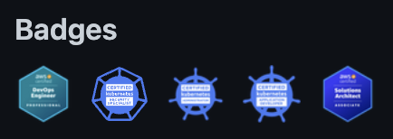

계획을 적은 장황한 글을 제외하면 첫 번째 블로그이다. 한창 블로그 꾸미기에 열중하는 나는 깃헙 프로필처럼 내가 가진 스킬이나 자격증을 예쁘게 보여주고 싶었다. 아래 내 블로그처럼 말이다 😁

한 가지 문제는 과거에 이런 시도를 한 블로그를 찾지 못했다. 꽤 오랜 시간을 찾았는데도 [오픈 소스](https://github.com/pemtajo/badge-readme) 하나밖에 발견하지 못했다. 이 오픈 소스는 GitHub Action으로  Credly의 배지를 가져와 Readme를 주기적으로 업데이트하는 프로젝트였다. 이 오픈 소스를 참고해 Credly의 배지를 가져와 JSON 파일로 저장하는 오픈 소스 프로젝트를 만들었다. JSON 파일로 만든 이유는 용도에 상관없이 가장 자유롭게 쓰일 수 있는 형식이기 때문이다.

프로젝트는 [kaonmir/credly-crawler](https://github.com/kaonmir/credly-crawler)에서 확인할 수 있다.


아래는 이 프로젝트를 사용해 Hugo 블로그를 개선하는 방법을 알아본다. 다른 블로그나 사이트도 JSON 파일을 가공하면 손쉽게 적용할 수 있을 것이다.

## 1. GitHub 토큰을 발급받고 등록하기

Credly에서 배지 JSON 파일을 추출해 여러분의 프로젝트에 커밋을 한다. 이때 GitHub 토큰을 사용해야 한다. 토큰은 [Settings > Developer Settings > Personal access token](https://github.com/settings/tokens?type=beta) 창에서 발급받을 수 있다.

토큰을 발급받을 때는 [최소 권한 원칙](https://www.cloudflare.com/ko-kr/learning/access-management/principle-of-least-privilege/#:~:text=%22%EC%B5%9C%EC%86%8C%20%EA%B6%8C%ED%95%9C%20%EC%95%A1%EC%84%B8%EC%8A%A4%22%EB%9D%BC%EA%B3%A0%EB%8F%84%20%ED%95%98%EB%8A%94,%EB%B6%80%EC%A0%95%EC%A0%81%EC%9D%B8%20%EC%98%81%ED%96%A5%EC%9D%B4%20%EC%BB%A4%EC%A7%91%EB%8B%88%EB%8B%A4.)에 따라 필요한 만큼의 권한만 줘야 한다. 나는 아래와 같이 권한을 설정했다.

- **Repository access**: `kaonmir/kaonmir.github.io`에만 접근할 수 있도록 했다.
- **Permissions**:
  - Contents: `Read and write`
  - Metadata: `Read only`

이제 발급받은 토큰을 각자의 리포지토리에 Secret으로 등록한다. 프로젝트의 **Settings > Secrets and Variables > Actions** 아래에 **New Repository Secret** 버튼을 클릭해 등록할 수 있다. 이때 토큰을 `GH_TOKEN`이라는 이름으로 등록한다. 이후에 GitHub Action에서 이 토큰을 사용한다.

## 2. Github Action 등록

이제 Credly의 배지를 가져와 JSON 파일로 저장하는 GitHub Action을 등록한다. 이 예제는 Hugo 블로그를 기준으로 작성했다. 다른 블로그를 사용한다면 `CREDLY_DIR`을 수정해 적절한 위치에 JSON 파일을 저장하면 된다. 또한, `CREDLY_USER`를 수정해 자신의 Credly 사용자 이름으로 바꿔야 한다.

```yaml
name: Update badges

on:
  workflow_dispatch:

jobs:
  update-credly-data:
    name: Update Json data with badges
    runs-on: ubuntu-latest
    steps:
      - name: Credly data - Hugo
        uses: kaonmir/credly-crawler@main
        with:
          GH_TOKEN: ${{ secrets.GH_TOKEN }}
          REPOSITORY: kaonmir/kaonmir.github.io
          CREDLY_USER: kaonmir
          CREDLY_DIR: data/credly.json
          BADGE_SIZE: 32
```

## 3. Hugo 템플릿 수정하기

위 Action을 실행하면 `data/credly.json` 파일이 생성된다. 이 파일을 Hugo 템플릿에서 사용해 배지를 보여줄 수 있다. 아래는 `data/credly.json` 파일을 사용해 배지를 보여주는 예제이다. HTML을 수정하는 위치는 테마마다 모두 다르다. 각자가 벳지를 보여주고 싶은 위치에 아래 코드를 추가하면 된다.

이 블로그에서 사용한 예제는 [Compare Changes](https://github.com/kaonmir/kaonmir.github.io/compare/9f82d10fa234def70e01d5c609ba6adcba1b66d6...340aabc75f099c89737e605baa3ebc84ac6d9975)를 참고하면 된다.

```html
<div class="border-top color-border-secondary pt-3 mt-3 clearfix hide-sm hide-md">
  <h2 class="mb-2 h4">Badges</h2>
  <div style="display:flex;justify-content:flex-start;flex-wrap:wrap;margin-bottom:3px;">
    {{ range .Site.Data.credly.badges }}
    <a style="margin: 0 10px 10px 0;" href="{{ .href }}" data-badge-title="{{ .title }}">
      
    </a>
    {{ end }}
  </div>
</div>
```  

이제 모든 준비가 끝났다. `hugo server`를 실행해 블로그를 확인해보자.

그러면 아래 그림처럼 배지가 잘 보여지는 것을 확인할 수 있다.



## 마치며

이제 Credly의 배지를 Hugo 블로그에 적용하는 방법을 알아봤다. 다른 블로그를 사용한다면 JSON 파일을 가공해 적절한 위치에 저장하면 된다. 이제 Credly의 배지를 블로그에 적용해 자신의 자격증을 자랑해보자! 😎
