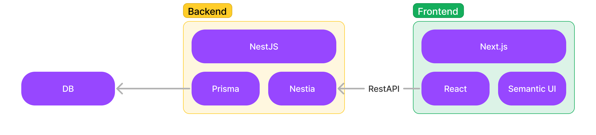

본격적으로 작정하고 시작하는 토이 프로젝트, 그 첫 번째 글입니다.

프로젝트 시작 동기야 뭐 뻔하니 넘어가고 무엇을 어떻게 만들 것인지에 대해 고심해봅니다.

## 무얼 만들 것인가

특별한 작품 하나를 선정해서 만드는 것도 많은 의의가 있습니다. 하지만 이번에는 지극히 단순하지만 필요하며, "왜 없지?"라는 생각이 드는 페이지부터 차근차근 만들어 갑니다.

제일 먼저 만들 페이지는 "빈 페이지"입니다. 정말 단순하게 하나의 색깔로 채워진 페이지가 없어서 스크린샷을 찍을 때 불편했습니다. 오른쪽 귀퉁이에 마우스를 올리면 color picker가 나타나 배경색을 선택할 수 있도록 만들 것입니다. 백엔드는 필요 없을 것입니다.

다음으로는 수많은 convertor를 모아놓은 페이지를 만들 것입니다. JSON prettier/minifier나 Base64 변환기 등 유용한 사이트들이 정말 많습니다. 하지만 모두 일일히 검색해서 들어가야 하는 불편함이 있습니다. 유료 애플리케이션이 출시되어 있긴 하지만 저는 무료로 이 모든 것을 만들어 배포하고 싶습니다.

막상 적고 보니까 백엔드가 들어갈 여지가 없네요 ㅎㅎ 당장 백엔드를 만들어야 한다! 뭐 이런 건 없으니 차차 생기리라 믿습니다.

## 프로젝트 아키텍처



만약 3-tier architecture가 필요하게 된다면 위 그림처럼 구성할 것입니다.

- [Semantic UI](https://semantic-ui.com/) : 적당히 반쯤 만들어진 UI를 가져다 쓸 것입니다. 이쁘게 꾸미는 건 제 역할이 아닙니다 :)
- [Apollo Client](https://www.apollographql.com/docs/react/) : GraphQL을 호출하고 캐싱하는 도구입니다.
- [Nestia](https://github.com/samchon/nestia) : NestJS의 API를 SDK로 만들어서 프론트엔드 개발을 완전 편리하게 만드는 라이브러리입니다.

- [Prisma](https://www.prisma.io/) : 데이터베이스를 형상 관리하며, 테이블(Model)을 호출하는 SQL을 SDK로 만들어서 백엔드 개발을 완전 편리하게 만드는 라이브러리입니다.

Nestia와 Prisma 모두 컴파일 단에서 모든 에러를 잡고 단순 문자열 오타로 인해 발생하는 치명적인 문제를 막을 수 있습니다. 타입스크립트 하나로 모든 코드는 구성됩니다. 그리고 모노리포로 프론트엔드와 백엔드는 연결됩니다. 그래야 Nestia SDK를 효율적으로 쓸 수 있어요.

## 개발 말고 다른 의사결정들

### 배포

저는 돈을 내고 싶지 않습니다. 끊임없이 무료를 찾아왔고 찾고 있습니다.

- **프론트엔드** :  사실상 정답이 있습니다. GitHub Pages에 배포하는 것입니다.
- **백엔드** : 명확한 정답이 없습니다. 일단 [Qoddi]( https://www.couchcoding.kr/blogs/couchcoding/%ED%8F%AC%ED%8A%B8%ED%8F%B4%EB%A6%AC%EC%98%A4%EC%9A%A9%20%EB%AC%B4%EB%A3%8C%20%EB%B0%B1%EC%97%94%EB%93%9C%20%EC%84%9C%EB%B2%84%20%EB%A7%8C%EB%93%A4%EA%B8%B0%20(Qoddi)%20-%20Spring%20%EB%B0%B0%ED%8F%AC%20%EC%98%88%EC%A0%9C)라는 서비스가 무료로 제공한다고 해서 써볼 계획입니다. 이것도 실패하면 3개월 철새로 GCP를 전전하던가 아니면 안쓰는 노트북에 포트포워딩 걸어서 사용하던가 해야 할 것 같습니다.
- **데이터베이스** : 이전에 사용했던 [ElephantSQL](https://www.elephantsql.com/)도 괜찮았고 Qoddi에서도 데이터베이스를 지원한다고 합니다. 여기서는 일단 Qoddi 중심으로 가볼 생각입니다.

### 브랜치 전략 & CI/CD

처음에는 다 무시하고 main 브랜치만 쓰고 싶었는데, 성격을 조금 줄이고 [Git Common Flow](https://commonflow.org/)를 사용할 것입니다. 그리고 저는 커밋 메시지에 머지되었다고 적혀 있는 것을 좋아하지 않습니다. 그래서 [fast-forward merge](https://git-scm.com/docs/git-merge#_fast_forward_merge)를 사용해 커밋 메시지를 깔끔하게 가져갈 생각이었습니다. 그런데 GitHub에는 fast-forward merge와 비슷하게 **Rebase and merge** 옵션을 별도로 만들어서 깔끔한 커밋을 지원한다고 해서 이를 사용할 것입니다. 설정에서 강제해야지요.

스테이징 환경은 따로 만들지 않습니다. 오로지 main 브랜치에 머지되었을 때 프로덕션으로 바로 배포하는 CI/CD만 존재합니다. 프론트는 도커라이징을 하지 않고 바로 빌드 후 GitHub Pages로 배포하고요, 백엔드는 도커로 만든 후 배포합니다. 도커 태그는 일단 커밋 SHA로 하는 걸로 할까요.

### 커밋 메시지

Husky로 강제할까 고민하고 있습니다. 하면 커밋 메시지가 깔끔해지는데 스트레스 지수가 높아지는지라... 지금은 비교적 널널하게 개발하고 만약 협업을 하게 된다면 Husky를 적용해 커밋 메시지를 자동화하는 게 좋을 것 같습니다.

프론트와 백엔드의 커밋 메시지는 구분해야 하기 때문에 `feat(F)`, `fix(B)`처럼 F, B 접두어로 구분할까 합니다.커밋 메시지 컨벤션은 회사에서 쓰던 컨벤션을 변형해서 만들었습니다. 회사에서는 이보다 많은 컨벤션을 쓰지만 이번 프로젝트는 최대한 간략하게 6 단계로만

```plain
feat: 기능 개발, 리펙터링
fix: 오류 수정
rename: 파일, 변수, 함수 이름
design: 디자인, 문장 수정
chore: CI/CD, 환경 변수, 패키지 주석 수정
docs: 문서 수정
```

### 그 외

노드 버전을 v18.12.1 하니, 폴더 구조를 어떻게 하니 등등은 나중에 정하는 것이 좋을 것 같습니다. 공식 문서처럼 짜임새 있게 만들고 싶다는 욕심도 있고요.
