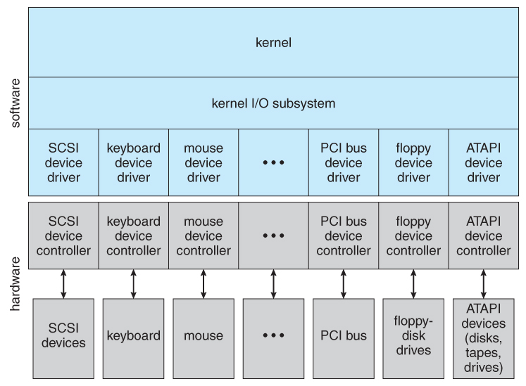

## 운영체제가 할 일

컴퓨터 시스템은 대개 하드웨어, 운영체제, 응용 프로그램 및 사용자 네 가지 구성요소로 구분할 수 있다.

운영체제는 정부와 유사하다. 운영체제는 컴퓨터 시스템이 효율적으로 동작하기 위해 적절히 자원을 사용할 수 있는 방법을 제공한다. 또한 운영체제 그 자체로는 유용하지 않고, 다른 프로그램들이 유용한 작업을 할 수 있도록 환경을 제공한다.

### 사용자 관점

대부분 일반 사용자를 위한 컴퓨터는 자원을 효율적으로 이용하는 것보다는 사용의 편의성을 최대로 하는 것에 중점을 맞춘다. 이런 시스템들은 다수의 사용자보다는 한 사용자가 사용하기 적합하도록 최적화된다.

반면, 대형 컴퓨터나 미니컴퓨터에 연결된 터미널에 앉아 있는 사용자도 있다. 이들은 한 컴퓨터를 여러 터미널에서 접근하고 있고, 자원과 정보를 교환한다. 자원은 효율적으로 사용되며, 각 개인은 자신의 정당한 몫만 사용할 수 있다.

또한, 서버로 구성된 네트워크에서 워크스테이션 앞에 앉아 있는 사용자도 있다. 이들은 각자의 전용 자원을 갖지만 파일, 프린트 서버와 같은 서버를 공유한다. 따라서 이 경우 운영체제는 사용 편의성과 자원 이용 간의 적절한 조화를 이루도록 설계된다.

최근에는 사용자 관점이 매우 작은, 가전제품이나 자동차 같은 컴퓨터도 설계되고 있다.

### 시스템 관점

운영체제는 자원 할당자이다. CPU, 메모리, 디스크, 입출력 장치 등 여러 물리적인 자원과 직접 소통하며 적절하고 공정하게 프로그램에 자원을 할당할 수 있어야 한다.

운영체제는 제어 프로그램이다. 프로그램의 행위를 제한하고 부적절한 접근을 막는다. 특히 입출력 장치의 연산과 제어에 깊이 관여한다.

### 운영체제란?

운영체제는 넓게 보면 하드웨어와 소프트웨어를 관리하는 소프트웨어라고 할 수 있고, 일반적인 관점으로는 커널, 시스템 프로그램를 포함한다.

- **커널** : 하나의 프로그램으로 시스템을 제어한다.
- **시스템 프로그램** : 운영체제와 연관은 있으나 반드시 커널에 포함될 필요는 없는 프로그램
- **응용 프로그램** : 시스템의 동작과 관계없는 모든 프로그램

## 컴퓨터 시스템 구성

### 컴퓨터 시스템 동작

1. 컴퓨터의 전원 버튼을 누르면 ROM/EEPROM에 저장된 부트스트랩 프로그램(펌웨어)이 실행된다.
2. 펌웨어는 시스템을 초기화하고 운영체제 커널을 찾아 메모리에 적재한다.
3. 시스템 프로그램에 의해 제공되며, 계속 실행되는 프로그램을 시스템 프로세스 혹은 시스템 데몬이라고 한다. 커널은 이들을 관리하는 init 프로세스를 제일 먼저 실행한다.
4. 이제 부팅이 끝났고 시스템은 인터럽트를 통한 이벤트를 기다린다. 하드웨어는 시스템 버스를 통해 CPU에 신호를 보내 인터럽트를 발생시키고, 소프트웨어는 시스템 호출 (system call)을 통해 발생시킨다.
5. CPU가 인터럽트되면, CPU는 하던 일을 멈추고 인터럽트 서비스 루틴을 실행한다. 완료하면 원래 상태로 복귀하고 하던 연산을 재개한다. (인터럽트는 ‘끼어들기’다)

### 기억장치 구조

폰노이만 구조 시스템에서는

1. 메모리에서 명령을 인출(fetch)해 명령 레지스터에 저장하고
2. 메모리에서 필요한 피연산자를 인출해 내부 레지스터 저장한다.
3. 그리고 연산을 한 후 결과를 다시 메모리에 저장한다.

이렇듯 프로그램 실행을 위해서는 메모리와 끊임없이 상호작용한다. 하지만 주기억장치(RAM)는 모든 프로그램을 담기에는 용량이 작고, 휘발성이다. 이를 해결하기 위해 우리는 HDD, SDD 같은 보조 기억장치를 추가로 사용한다. 이렇게 저장장치는 계층으로 이루어져 있다. CPU와 직접 상호작용하는 캐시나 RAM은 단가가 비싸고 빠르며 휘발성이다. 반면 CPU와는 거리가 먼 보조 기억장치는 단가가 싼 대신 용량이 크고 느리다.

### 입출력 구조

범용 컴퓨터에는 여러 개의 장치 제어기(device controller)와 CPU가 공통 버스로 연결되어 있다. 각 제어기는 특정 유형의 장치와 소통하며 약간의 로컬 버퍼와 특수 목적용 레지스터 집합을 관리한다. 이 정보를 디바이스 드라이버를 통해 운영체제로 보내는데, 디바이스 드라이버는 장치 제어기의 동작을 이해하고 동일한 인터페이스를 제공하는 역할을 한다. 장치 제어기를 기준으로 입출력을 이해해보자.

1. 운영체제가 드라이버에게 제어 권한을 주면서 명령을 한다.
2. 드라이버는 제어기의 적절한 레지스터에 명령을 싣는다.
3. 제어기는 레지스터를 조사해 “키보드에서 문자를 읽어라" 같이 자신이 해야할 일을 인식한다.
4. 제어기는 장치로부터 데이터를 받아들여 자신의 버퍼에 저장한다.
5. 한 바이트의 저장이 끝나면 제어기는 드라이버에게 인터럽트를 통해 통보한다.
6. 드라이버는 운영체제에게 제어 권한을 반납하면서 데이터도 반환한다.
7. 운영체제는 데이터를 메모리에 저장한다.

이 구조는 장치 → CPU → 메모리 구조를 가지기 때문에 느리다. 따라서 직접 메모리 접근(DMA) 장치를 사용해 버퍼의 데이터 블록을 메모리에 바로 전송할 수도 있다. DMA 장치는 한 바이트마다 인터럽트를 발생시키는 기존 장치와 다르게 블록 전송이 완료될 때마다 인터럽트를 발생시킨다.

## 컴퓨터 시스템 구조

- **싱글 프로세서** : CPU를 하나만 가지는 전통적인 컴퓨터 시스템.
- **멀티 프로세서** : CPU를 여러 개 사용해 병렬로 작업을 처리하는 시스템.
- **클러스터** : 독자적인 시스템을 연결하여 구성한 시스템

### 멀티 프로세서

한 번에 여러 개의 CPU를 작동시키기 때문에 처리량(throughput)이 늘어나고, RAM 같은 주변 장치를 더 크게 가져갈 수 있다. 또한 CPU 하나가 고장 나도 시스템은 멈추지 않고 동작한다. 이를 우아한 퇴보 혹은 결함 허용이라 부른다. 고도의 신뢰성을 보장해야 하는 경우, 두 개의 프로세서에 같은 동작을 시키고 결과를 비교하는 방식을 사용하기도 한다.

멀티 프로세서는 비대칭과 대칭으로 나눈다. 비대칭은 CPU 간에 주종 관계가 있어, 주 프로세서는 스케줄링을 하고 종속 프로세서에게 작업을 할당하는 방식이다. 대칭은 프로세서 각자 독립적으로 스케줄링 및 작업 처리를 한다. 이 방식은 모든 CPU를 효율적으로 사용할 수 있지만, 자칫하면 몇 개는 쉬고 몇 개만 일하는 경우가 생길 수 있다. 이 불균형은 운영체제가 해결해야 하는 것으로, 운영체제는 SMP 방식을 사용해 여러 프로세서가 한 개의 공유 메모리에 접근하고 관리하도록 한다.

SMP 방식의 단점은 여러 프로세서가 한 메모리에 동시에 접근할 수 없다는 것이다. 따라서 메모리 접근 모델을 균등 메모리 접근(UMA)에서 비균등 메모리 접근(NUMA)으로 바꿔 이를 해결한다. UMA는 어느 CPU든 메모리에 접근하는데 같은 시간이 걸리는 경우이고, NUMA는 CPU에 따라 메모리에 접근하는 시간이 다른 경우이다. NUMA는 [비균등 메모리 접근(Non-Uniform Memory Access, NUMA)](https://www.notion.so/Non-Uniform-Memory-Access-NUMA-9d4b7508a7f1426ebb507c531348defa?pvs=21) 에서 더 자세하게 보자.

최근에는 멀티 프로세서에서 멀티 코어로 발전하고 있다. 멀티 코어 방식은 하나의 CPU에 여러 코어를 포함시키는 것으로 통신이 빠르고 전력을 훨씬 적게 소모한다. 주의해야 하는 점은 멀티 코어는 멀티 프로세서 시스템이지만, 그 반대는 아니다.

마지막으로 독립적인 운영체제를 가지는 보드를 엮은 블레이드 서버가 있다. 이 방식은 기존의 방식과 구분하기 모호하며, 본질적으로는 여러 독립적인 멀티 프로세서로 구성된다.

### 클러스터

클러스터 시스템은 독자적인 시스템(노드)을 연결하여 구성한다. 각 노드는 싱글/멀티 프로세서 시스템일 수 있다. 클러스터의 정의가 기업마다 다른데, 일반적으로 LAN이나 InfiniBand 같은 고속 상호연결망(interconnect)으로 묶여, 하나의 저장장치를 공유하는 방식을 말한다.

이 방식은 고가용성(high availability, HA)을 제공한다. HA는 한 노드가 고장나도 시스템 전체가 멈추지 않고 계속 동작하는 것을 말한다. 클러스터도 대칭, 비대칭이 있다.

- 비대칭 : 한 노드는 작업을 수행하고 나머지 노드는 긴급 대기 상태(hot-standby)를 유지한다. 노드가 고장 나면, 대기 상태의 노드가 작업에 바로 투입된다. active-passive라고도 한다.
- 대칭 : 모든 노드가 각자의 작업을 수행하고, 한 노드가 고장나면 다른 노드로 작업이 이관된다. active-active라고도 한다.

클러스터는 다수의 컴퓨터 시스템을 연결해 쓰기 때문에 고성능 컴퓨팅 환경(High Performance Computing, HPC)을 만들 수 있다. 이는 하나의 프로그램을 여러 노드로 나눠서 처리하는 방식으로, 응용 프로그램 단에서 지원해야 한다. 예를 들어 16개의 덧셈을 해야 한다면, 여러 노드에 덧셈을 나눠주고 결과를 취합하는 방식이다.

그 외에도 병렬 클러스터, WAN 클러스터 방식이 있다. 또한 스토리지 에리어 네트워크(SAN) 방식이 등장하면서 작업을 공유할 수 있다.

## 운영체제 구조

CPU가 적게 쉴 수록 좋은 거다.

### 다중 프로그래밍

- 디스크 : 작업 풀(pool)을 만들고 그 안에 모든 프로세스를 넣는다.
- 메모리 : 작업 풀 안의 프로세스 중 동작해야 하는 프로세스 몇 개만 메모리에 올린다.
- 프로세서 : 스케줄링에 따라 메모리에서 프로세스를 가져와 실행한다.

이렇게 디스크 → 메모리 → 프로세서 구조를 이용해서 프로세스를 처리하면 프로세서는 쉬지 않고 끊임없이 일하게 된다.

### 멀티테스킹 (시분할)

멀티테스킹은 다중 프로그래밍의 확장이다. 하나의 작업을 끝내고 다른 작업을 하는 것이 아니고, 다수의 작업을 계속 교체해가며 실행하는 것을 말한다. 이렇게 하면 사용자는 모든 작업이 동시에 일어나고 있는 것처럼 느끼게 된다. 사용자는 동작을 지시했을 때 즉각 반응이 나타나길 원하기 때문에, 1초 이내의 짧은 시간에 작업을 교체하면서 동작한다.

멀티테스킹 시스템은 여러 사용자가 컴퓨터를 공유할 수 있게 한다. 각 사용자별로 짧게 짧게 CPU를 할당하면서 진행하면 되기 때문에 모든 사용자는 오래 기다린다는 느낌 없이 작업을 진행할 수 있다. 특히 사용자의 입력은 매우 느리기 때문에, 입력을 기다리는 동안 다른 작업을 왕창 처리하고, 입력이 끝나면 해당 작업을 처리한다.

멀티테스킹과 다중 프로그래밍 방식을 구현하기 위해서는 작업 스케줄링을 통해 메모리에 적재할 프로세스를 선택하고, 메모리를 관리하고, CPU 스케줄링을 해야한다. 또 메모리를 확장하는 기술인 가상 메모리 방식을 통해 프로세스의 일부만 메모리에 실을 수 있고, 가상 메모리와 물리 메모리를 연결하기 위해 논리 메모리 방식도 사용해야 한다.

## 운영체제 연산

현대 운영체제는 인터런트 구동식(interrupt driven)이다. 사건이 발생하면 즉시 하드웨어나 소프트웨어가 인터럽트를 발생시킨다. 그러면 운영체제는 적절히 인터럽트를 처리한다. 트랩(혹은 예외)는 소프트웨어가 만든 인터럽트로서, 오류나 시스템 호출에 의해 발생한다. 운영체제는 트랩을 감지하고, 한 프로세스의 오작동이 시스템 전체에 확산되지 않도록 방지하는 역할을 수행한다.

### 이중연산모드

운영체제는 사용자 모드와 커널 모드 두 가지 모드로 동작한다. 커널 모드는 사용자 프로그램이 직접 다뤄서는 안되는 특권 명령을 수행하기 위한 모드이다. 특권 명령은 입출력 제어, 타이머, 인터럽트 관리 등이 있다. 커널 모드로 전환하는 명령도 특권 명령이다. 현재의 모드는 모드 비트를 통해 나타낸다. 응용 프로그램은 사용자 모드(0)에서 실행되다가 운영체제의 기능을 이용해야 하면 커널 모드(1)로 전환해 동작한다.

1. 시스템 부트 시 하드웨어는 커널 모드로 시작하고, 운영체제가 적재된 후 사용자 모드로 바뀐다.
2. 트랩이나 인터럽트가 발생하면, 하드웨어는 커널 모드로 전환된다.
3. 작업이 끝나면 다시 사용자 모드로 바꾸고, 시스템은 프로그램에게 제어를 넘긴다.

모드는 여러 개가 있을 수 있다. 예를 들어, 가상화를 지원하는 CPU는 가상머신 관리자(VMM)이 시스템을 제어하고 있는지를 나타내기 위해 별도의 비트를 사용한다. 인텐 64 계열은 4 개의 특권 수준을 지원하기도 한다.

트랩은 trap 명령이나 syscall 명령어를 통해 실행되며, 하드웨어에 의해 하나의 소프트웨어 인터럽트로 취급된다. 그러면 인터럽트 벡터를 통해 운영체제 내의 서비스 루틴으로 전달되고 커널 모드로 전환한다. 커널은 인터럽트를 검사해 매개변수를 검증하고 시스템 호출을 수행한다. 하드웨어에 대한 불법적인 접근 또한 트랩으로 취급된다.

### 타이머

프로그램이 무한 루프에 빠지거나 시스템 호출에 실패해 제어가 운영체제로 복귀하지 않는 경우, 타이머를 사용해 해당 프로그램을 처리한다. 타이머는 가변 타이머를 주로 사용하는데, 고정률 클락과 계수기를 사용한다. 클락이 tick할 때마다 계수기가 감소하고, 계수기가 0이 될 때 인터럽트를 발생한다. 인터럽트가 발생하면 CPU는 해당 프로그램을 오류로 취급하고 종료한다.

## 프로세스 관리

프로세스는 실행 중인 프로그램이다. 한 시스템 안에서 작업의 단위이며, 스케줄링의 단위이다. 프로세스는 자신의 일을 하기 위해 CPU 시간, 메모리 등 자원을 필요로 하고, 운영체제에 의해 적절히 할당 받는다. 프로세스들은 하나의 CPU를 멀티플렉싱함으로써 병행 수행될 수 있다. 운영체제는 프로세스 관리에 있어 생성과 제거, 스케줄, 일시중지와 재실행, 동기화와 통신 작업을 책임진다.

프로그램과 프로세스의 차이를 주의하자. 프로그램은 디스크에 저장된 수동적 개체인 반면, 프로세스는 프로그램 카운터를 가진 능동적 개체이다. 객체 지향으로 설명하면 클래스와 인스턴스의 관계라 볼 수 있다. 한 프로세스는 한 번에 명령 하나씩만 수행된다. 다중 스레드 프로세스의 경우에는 복수 개의 프로그램 카운터를 가지고 있어 병렬적으로 실행될 수 있다.

## 메모리 관리

메모리는 각자 고유의 주소를 가지는 대용량 바이트 배열이다. 폰 노이만 구조에서 CPU는 메모리와 소통하며 명령어를 인출하고 데이터를 읽고 쓴다. CPU가 직접 접근하는 유일한 대량 메모리이고 보조 기억 장치를 매개하는 수단으로 사용된다. 메모리 관리는 하드웨어 설계에 의존적이기 때문에 적절한 알고리즘을 선택해야 한다. 운영체제는 메모리 관리에 있어 사용 추적, 적재 및 제거 선택, 공간 할당 및 회수 작업을 책임진다.

## 저장장치 관리

운영체제는 저장장치의 물리적 공간을 논리적 단위인 파일로 추상화한다. 그리고 유저가 파일을 읽고 쓰면, 파일을 저장장치에 물리적으로 저장하는 역할을 맡는다.

- **파일시스템** : 디스크를 추상화하고 사용자에게 친숙한 디렉터리 구조를 제공한다. 또한 읽기, 쓰기, 실행 권한 관리을 관리한다.
- **대용량 저장 장치** : 컴퓨터 시스템의 모든 정보를 담는 보조 기억장치와, 백업 용도로 사용되는 3차 저장 장치를 관리한다.
- **캐싱** : 메모리에서 정보를 읽는 시간을 줄여 CPU가 노는 시간을 최소한으로 만든다.
- **입출력 시스템** : 사용자에게 하드웨어 장치의 특성을 숨기고 일관된 인터페이스를 제공한다.

### 캐싱

빈번히 읽어야 하는 정보를 매번 메모리까지 가서 읽으려니 시간이 오래 걸린다. 그래서 중간에 캐시를 둬 메인 메모리를 보조하게 한다. CPU는 캐시에서 먼저 정보를 찾고, 없으면 메인 메모리, 또 없으면 디스크에서 정보를 찾는다. 덧붙여, CPU에 딱 붙어서 초고속 캐시 역할을 하는 인덱스 레지스터도 있다.

메모리 관리처럼 캐시 관리도 설게의 중요한 문제이다. 캐시 교체 알고리즘을 잘 선택한다면 접근의 80~99%를 캐시에서 얻을 수도 있다. 인덱스 레지스터는 하드웨어로 구현이 되므로 운영체제가 간섭하지 못 한다.

CPU가 연산의 결과를 저장하려 하는데 어떻게 저장하는지도 중요한 문제이다. 캐시에만 저장하면 메모리의 정보와 달라지게 되고, 캐시에서 디스크까지 하나씩 저장하면 속도가 느려지게 되는 딜레마도 해결해야 한다. 또한 여러 CPU가 특정 정보를 요구할 때, 같은 정보를 준다는 걸 보장하는 문제도 있다. 캐시들끼리는 하드웨어적으로 정보의 일관성을 유지할 수 있다. 더 복잡하게 나아가면, 분산 환경에서 정보의 일관성을 보장하는 문제까지 생각할 수 있다.

## 보호와 보안

보호(protection)란 자원에 대해 프로세스, 사용자의 접근을 제어하는 기법이다. 고장난 프로세스가 시스템 전체를 망가뜨리는 것을 예방하고, 자원을 오남용하지 못 하도록 방지한다. 그렇다면 사용자 인증 정보 (비밀번호 등)가 도난당했다면 어떻게 막을까? 보안(security)는 바이러스, 웜, 인증 도용 등 내외부의 부정한 칩입을 막는 기법을 말한다.

운영체제는 사용자 ID 목록을 만들어 모든 사용자를 구분한다. 사용자가 로그인할 때마다 인증을 관리하고, 이들을 묶어 그룹으로 관리하기도 한다. 사용자는 하나 이상의 그룹에 속할 수 있고, 그룹별로 권한을 할당할 수 있다. 운영체제는 그룹도 그룹 ID 목록을 만들어 관리한다. 원하는 작업을 수행하기 위해 권한을 상승해야 할 때가 있다. 운영체제는 나름의 권한 상승 시스템을 가지고 있는데 UNIX에서는 setuid 속성을 통해 파일의 소유주 ID를 이용하여 동작하게 할 수 있다. 프로세스는 이 유효 사용자 식별자(effective user ID)를 이용해 수행된다.

## 커널 자료구조

클릭해서 블로그 보자 → [연결리스트](https://www.notion.so/3009a426107e421b8afabf9fd4a60730?pvs=21), [스택](https://monsieursongsong.tistory.com/4?category=754667), [큐](https://monsieursongsong.tistory.com/5?category=754667), [트리](https://monsieursongsong.tistory.com/6?category=754667), [해시맵](https://www.notion.so/3009a426107e421b8afabf9fd4a60730?pvs=21), [비트맵](https://boycoding.tistory.com/164)

## 컴퓨팅 환경

- **전통적 컴퓨팅** : PC에 랜선을 꼽아 네트워크를 구성했다. 자원이 귀해 배치나 대화형 방식을 썼고 홈 네트워크의 방화벽을 가지고 있다.
- **이동형 컴퓨팅** : 휴대폰, 테블릿에서 자동차, 항공까지 모두 아우르는 컴퓨팅이다. 안드로이드와 IOS가 사실상 점유하고 있고, 위치 정보가 특히 중요한 환경이다.
- **분산 시스템** : 네트워크를 통해 하나의 시스템을 구성하는 방식이다. 거리에 따라 LAN, WAN으로 구분하고, 기본적으로 TCP/IP로 통신한다. 어떤 운영체제는 네트워크를 통해 프로세스끼리의 메시지를 공유하는 방식을 쓰는데, 네트워크 운영체제라 한다.
- **클라이언트 서버** : 우리는 로컬 PC를 클라이언트로 서버에 접근해 정보를 얻는다. 이 또한 분산 시스템의 하나로 정적(파일), 동적(계산) 정보를 제공한다.
- **피어 투 피어(P2P)** : 클라이언트, 서버가 구분되지 않고 동등하게 네트워크에 참여하는 것을 말한다. P2P를 통해 실시간 통화를 할 수 있는 VoIP 기술도 있다.
- **가상화** : 운영체제 위에 운영체제를 실행하는 것을 말한다.
- **클라우드 컴퓨팅** : 분산 시스템의 모든 컴퓨팅 자원을 가상화해 네트워크로 제공한다.
- **실시간 임베디드 시스템** : 특정 장치에 특수한 작업을 수행하는 시스템

### 가상화

가상화는 넓게 말해 에뮬레이션을 포함하는 소프트웨어이다. 에뮬레이션은 하드웨어의 CPU와 프로그램이 요구하는 CPU가 다를 때, 이를 소프트웨어로 전환하는 프로그램을 말한다. 또한 JVM처럼 동일한 소스코드를 여러 CPU 환경에 맞게 변역하는 가상 기계도 뜻한다.

좁은 의미의 가상화는 운영체제 위에 운영체제가 실행되는 것을 말한다. 이때 두 운영체제는 같은 CPU 타입을 요구한다. 예를 들어 x86 윈도우 위에 VMware 프로그램을 통해 x86 우분투를 실행한다. 가상화를 이용하면 하나의 서버에 여러 프로그램들을 동일한 환경에서 개발, 테스트, 디버깅할 수 있기 때문에 많이 사용된다.

### 클라우드 컴퓨팅

연산, 저장 등 모든 컴퓨팅 자원을 네트워크로 제공하는 것을 말한다. 가상화를 기반 기술로 쓰기 때문에 가상화와 분산 시스템의 조합이라 할 수 있다. 사용자는 클라우드 서비스 플랫폼(CSP)에 매월 사용료를 지불한다.

- 퍼블릭 클라우드 : AWS 같이 돈만 내면 누구나 이용 가능한 클라우드
- 프라이빗 클라우드 : 회사나 정부가 자체적으로 운영하는 클라우드
- 혼합형 클라우드 : 퍼블릭과 프라이빗을 모두 포함
- SaaS(Software as a service) : 인터넷을 통해 응용 프로그램을 사용 (워드 프로세스)
- PaaS(Platform as a service) : 인터넷을 통해  소프트웨어 스택을 사용 (MySQL 서버)
- laaS(Infrastructure as a service) : 인터넷을 통해 서버나 저장장치를 사용

### 실시간 임베디드 시스템

특정 장치에 내장되어 특수한 작업만을 수행하는 시스템이다. 사용자 인터페이스는 거의 없이 대부분 하드웨어를 관리하고 감시한다. 혹은 운영체제 없이 하드웨어로만 구현한 ASICs(Application-specific integrated circuit)도 있다. 비행기, 자동차 등에 주로 사용된다.

임베디드 시스템은 실시간 운영체제를 실행한다. 임베디드 시스템은 주로 시간 제약에 엄격하며, 중앙 컴퓨터와 소통해 공간 전체를 하나의 연결된 컴퓨터로 만들기도 한다.

## 오픈소스 운영체제

[오픈소스 소프트웨어의 역사](https://www.nepla.net/post/%EC%98%A4%ED%94%88%EC%86%8C%EC%8A%A4-%EC%86%8C%ED%94%84%ED%8A%B8%EC%9B%A8%EC%96%B4%EC%9D%98-%EC%97%AD%EC%82%AC)

[9.2.리눅스의 개발과 역사](http://it.ith.kr/chair/wh/wh0902.html)
